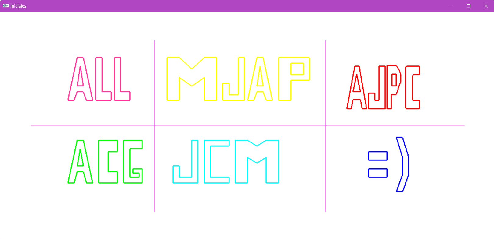

# Practica-Letras
Esta práctica se enfoca en el uso de la biblioteca OpenGL dentro del entorno CoreBlocks para representar gráficamente las iniciales de los nombres de los integrantes del equipo de trabajo. 

El objetivo es aplicar conceptos fundamentales de gráficos por computadora, tales como la creación de primitivas geométricas, el manejo de colores y la manipulación de coordenadas en el espacio bidimensional. 

A través de esta implementación, se busca que los estudiantes refuercen habilidades en la programación gráfica y comprendan la estructura básica de un pipeline gráfico, empleando funciones esenciales de OpenGL para dibujar formas que componen las letras de las iniciales.

## Código en ejecución

## Tecnologías

* C++
* OpenGL
* CoreBlocks

  ---
  Desarrollado con 💖 por [Anadalay](https://www.linkedin.com/in/anadalay-laureani/)
